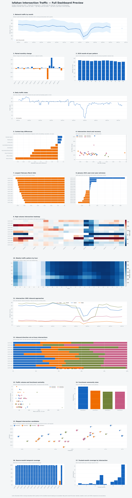

# Isfahan Intersection Graph Mining

This side project provides a deterministic, auditable workflow for the Isfahan SCATS detector archive in the parent directory. It does **not** modify the source text files, diagrams, spreadsheets, or legacy scripts.

## What it produces

- clean 15-minute intersection volumes partitioned by source month;
- detector and temporal coverage metrics instead of random imputation;
- approach-level entry volumes derived from the SCATS diagrams;
- daily, monthly, month-of-year, hourly, and weekday profiles;
- a functional intersection graph based on traffic-profile similarity;
- DTW-based daily-shape clusters;
- an OpenStreetMap-backed intersection registry and interactive city map;
- an Iran calendar, Isfahan weather, COVID-policy, and documented-event context layer;
- a figure-rich interactive dashboard for network and intersection change;
- an executed analysis notebook and a portable technical HTML report.

## Important interpretation

The numbered boxes in the SCATS diagrams are lane-detector channels placed on approaches to the stop line. Their values are therefore **approach entries into the junction**. They are not direct exit counts. A true directed link-flow graph requires a verified mapping from each approach to the next SCATS intersection (or an external road-network/GIS layer). This project never silently labels an entry count as an exit count.

For TCS 1081, the visually verified approach mapping is:

| Approach | Detector channels |
| --- | --- |
| South | 1, 2, 3 |
| West | 4, 5, 6 |
| North | 7, 8, 9 |
| East | 10, 11, 12 |

## Data-quality policy

- `0` is kept as a valid observed zero.
- `2046`, `2047`, and `NA` are treated as unavailable detector readings.
- No random replacement is used.
- A coverage-normalized volume is emitted only when enough configured detectors are available.
- Partial/missing months remain visible in the quality outputs.

This intentionally replaces the legacy cleansing behavior, which collapses repeated zeros in timestamps and randomly fills missing detector values.

## Run

Create an environment with Python 3.8+ and install the dependencies:

```powershell
python -m pip install -r requirements.txt
python scripts/run_pipeline.py all
```

Useful stage commands:

```powershell
python scripts/run_pipeline.py metadata
python scripts/run_pipeline.py geocode
python scripts/run_pipeline.py ingest
python scripts/run_pipeline.py context
python scripts/run_pipeline.py analyze
python scripts/run_pipeline.py visualize
python scripts/build_notebook.py
python scripts/build_report_artifact.py
python scripts/build_dashboard.py
```

Primary deliverables are `outputs/report/isfahan_traffic_analysis.html`,
`outputs/notebook/isfahan_intersection_analysis.ipynb`, and
`outputs/isfahan_intersections_map.html`. The report's canonical source payload is
kept beside it as `outputs/report/artifact.json` for reproducible repackaging.

The geocoder is cached, identifies itself, and stays below the public Nominatim one-request-per-second limit. Treat automatically geocoded coordinates as a review queue, not as municipal ground truth.

## External context

`python scripts/run_pipeline.py context` downloads hourly ERA5 weather for the
Isfahan city centre and the Oxford national COVID policy series, then joins them to
Iranian public holidays, Jalali dates, Nowruz/Ramadan flags, and the small documented
event registry in `data/external/manual/isfahan_events.csv`. Use `--force` to refresh
the cached remote snapshots.

The analysis-ready outputs are `data/external/processed/isfahan_daily_context.csv`,
`outputs/tables/city_daily_with_context.csv`, and the compressed intersection-level
`outputs/tables/intersection_daily_with_context.csv.gz`. Source URLs, hashes, scope,
and known limitations are recorded in `data/external/source_manifest.json` and
`outputs/tables/external_context_quality.json`.

These fields are candidate explanations, not causal labels. ERA5 is gridded
reanalysis, Oxford policies are national, and a lunar date can differ by a day from
local observation.

## Comprehensive dashboard

`python scripts/build_dashboard.py` rebuilds the deep analysis and packages a
self-contained dashboard at `outputs/dashboard/isfahan_intersection_dashboard.html`.
It includes network and site change, paired comparisons, daily and monthly trends,
weekly heatmaps, approach shares, Intersection 1081, functional communities,
centrality, coordinate candidates, external context, anomalies, and data quality.
Every figure includes a short description and its source/metric definition.

### GitHub preview

The image below is a static version of all 17 dashboard figures. Rebuild it with
`python scripts/build_dashboard_image.py`. The HTML dashboard remains the
interactive version.



## Project layout

```text
config/         manual overrides and analysis parameters
data/metadata/  intersection, detector, and geocoding registries
data/processed/ immutable derived partitions
data/external/  cached external snapshots, daily context, and reviewed events
outputs/        analytical tables, figures, map, notebook, and report
src/            reusable Python package
scripts/        command-line entry points
tests/          parser and analytical unit tests
```


``` Data source is excluded from the files ```
